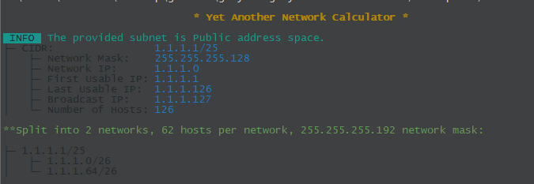
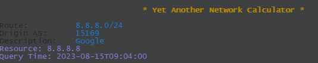

# go-yanc
Yet Another Network Calculator


 

Simple CLI Application in Go to split network subnets or perform RIPE WHOIS query on the IP

Usage example in Windows: 

```
go-yanc.exe -n 1.1.1.1/25 -split /26
```


```
go-yanc.exe -w 8.8.8.8
```

